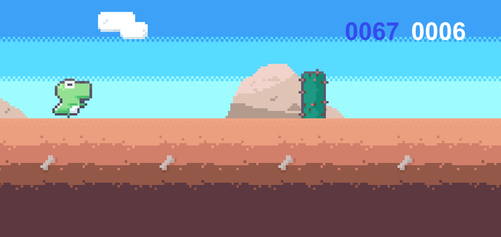

## *참고
<a href='https://www.youtube.com/watch?v=iENDSs0qXSs&list=PLO-mt5Iu5TebzgxMKYDw40mDxytgFBex0'>공룡 런게임 - ⚡ 볼트 시작하기 [유니티 볼트 입문 강좌 V01]</a>

Unity로 구글의 dino run 게임을 똑같이 만들어 보았습니다. 스크립트를 사용하여 개발하는 것이 목표지만 이번 프로젝트로 Unity에서 제공하는 BOLT라는 비주얼 스크립팅도 공부해보았습니다.  
BOLT를 추후까지 계속 사용하는지는 모르겠지만 비쥬얼 스크립팅 뿐만아니라 Unity프로젝트 자체에 대해서도 시각적으로 공부가 많이 되었기 때문에 매우 만족스러운 프로젝트였습니다.

## Preview

